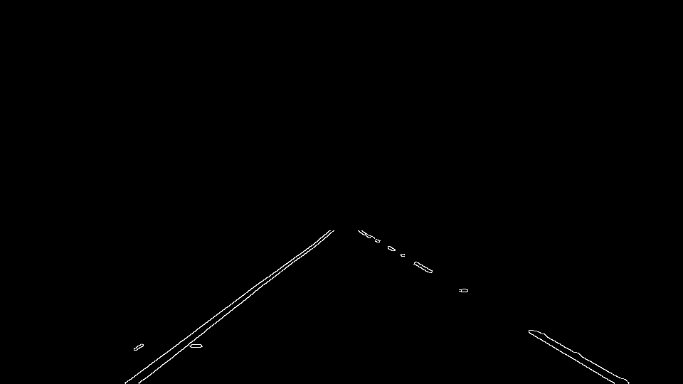
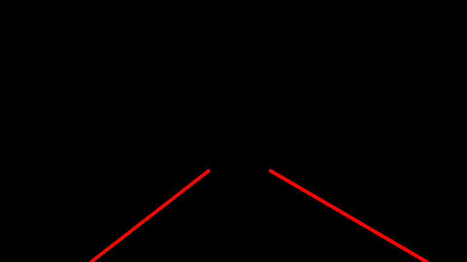
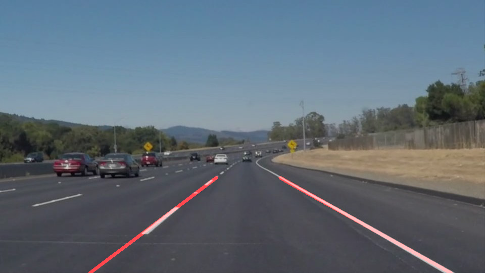
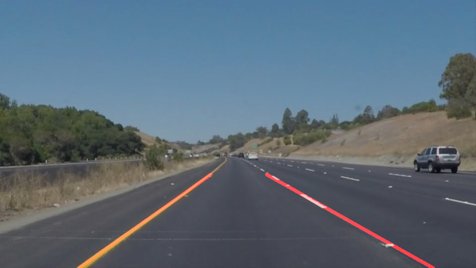
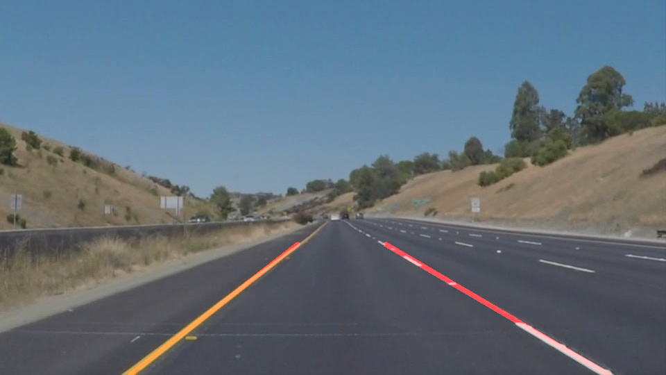

#**Finding Lane Lines on the Road**
---

**Finding Lane Lines on the Road**

The goals / steps of this project are the following:
* Make a pipeline that finds lane lines on the road
* Reflect on your work in a written report

---

### Reflection

###1. Describe your pipeline. As part of the description, explain how you modified the draw_lines() function.

My pipeline consisted of 8 steps:
1. Calculate the shape of the image/frame.
2. Find the region of interest using the image dimensions.
3. Convert the image to grayscale.

4. Perform Gausian Blur to aid in Canny Edge detection.

5. Perform Canny Edge detection to find edges in the image.

6. Remove the pixels outside of the region of interest. Using cv2.fillPoly we create a polygon around the pixels we care about and return those.

7. We then find lines in the region of interest using cv2.houghLinesP.

8. We then filter out unwanted lines, find left/right lines.

9. Using the draw lines function we use polyfit/regression to fit single line for each side.

In order to draw a single line on the left and right lanes, I modified the draw_lines() function by first filtering out lines that had an unexpected slope.
Using the slope, I then determined if a line was part of the left or right lane line. Once I knew this I could gather all of the x,y coordinates for each line.
With all of the x,y coordinates I could use polyfit to create a single line based on those coordinates. Then, using the poly1d function I was able to get the m and b variables (of the y=mx+b function) for each line. Knowing the equation for the line, I could then calculate different coordinates based on x or y values. In this case, I calculated the coordinates at the bottom of the image and at the top of the area of interest. I then connected those points to draw a line for each lane on the image.

Output:

###2. Identify potential shortcomings with your current pipeline

One potential shortcoming of my pipeline would be artifacts or lines similar to lane lines in the road that could throw off the calculation.
Like in the challenge video there seemed to be a lot of different lines detected, for example the wall on the left side of the image.

Another shortcoming of my pipeline would be if there was something blocking the lines. For example if a car was switching lanes in front of me,
I would lose a lot of the data needed to accurately find the lines.

###3. Suggest possible improvements to your pipeline

A possible improvement would be to better filter out unwanted lines. I could do more work to determine which lines are more likely to be lane lines by
tweaking the parameters for things like hough lines, canny edge detection, etc.

Another improvement could be to better handle dashed lines. Maybe decreasing the min line length could help.
